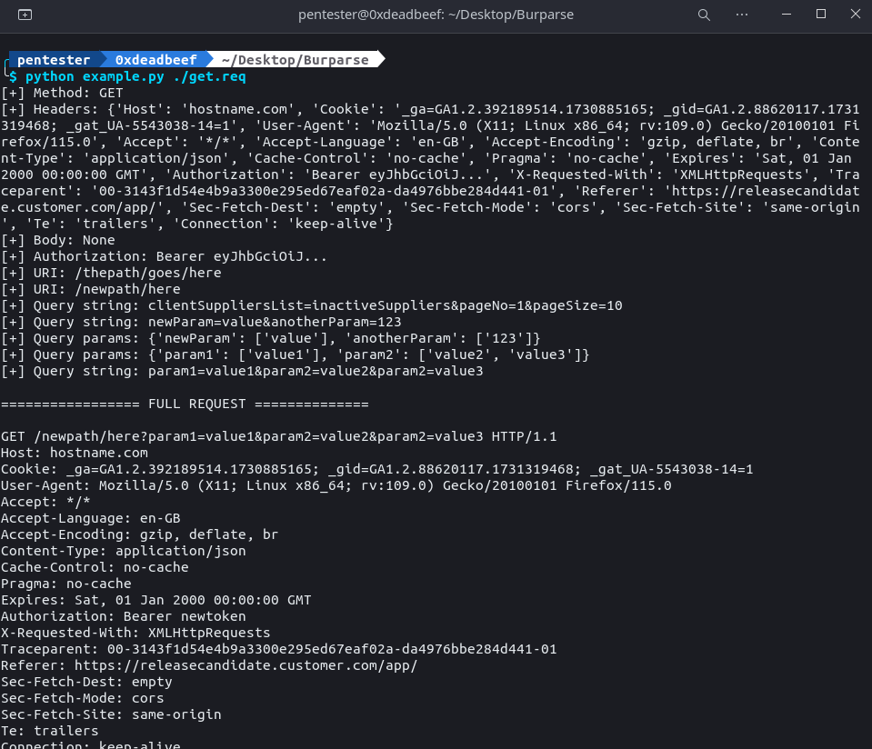

# Introduction

Burparse is a lightweight HTTP request parser and manipulator designed for developers and testers who frequently use tools like Burp Suite Repeater. It simplifies the process of converting raw HTTP requests into Python scripts for further automation or testing.

When working with Burp Suite, you may often find yourself, create complex Macros or manually copying raw HTTP requests into Python scripts for automation. Burparse addresses this need by offering a convenient way to parse, manipulate, and reconstruct HTTP requests programmatically.

---

## Features

- **Parse Raw HTTP Requests**: Easily parse raw HTTP requests (from a file) into their components: method, URI, query string, headers, and body.
- **Dynamic Header Manipulation**: Get, set, or update HTTP headers programmatically.
- **Body Updates**: Modify the request body directly, with automatic adjustment of the `Content-Type` header if a JSON object or URL-encoded form is provided.
  - If a JSON object is passed to `set_body()`, it automatically sets `Content-Type` to `application/json` and encodes the body as JSON.
  - If a URL-encoded string is provided, it sets `Content-Type` to `application/x-www-form-urlencoded`.
- **Query String Management**: Extract, modify, or update query string parameters easily with support for dictionary-based manipulation.
- **Full Path Reconstruction**: Seamlessly update the URI or query string while keeping the rest of the path intact.
- **HTTP Method Switching**: Change the HTTP method dynamically (e.g., from `POST` to `GET`).
- **Readable Reconstruction**: Reconstruct and export the modified request as a raw HTTP request string.

---

## On roadmap / pending

- File upload support
- Proxy support

---

## Installation

Clone the repository and import `Burparse` into your project:

```bash
git clone https://github.com/jcarabantes/burparse.git
```

Then, in your Python project:

```python
from burparse import Burparse
```

---

## Usage

### Parsing and Manipulating Requests

Example of loading a raw HTTP request file and modifying headers, body, and query strings:

```python
import sys
from burparse import Burparse

b = Burparse(sys.argv[1])

# Access properties
print("[+] Method: " + b.get_method())  # Outputs the HTTP method
print("[+] Headers: " + str(b.get_headers()))  # Outputs all headers
print("[+] Body: " + str(b.get_body()))  # Outputs the body

# Manipulate headers
print("[+] Authorization: " + b.get_header("Authorization"))  # Get specific header
b.set_header("Authorization", "Bearer newtoken")  # Set specific header

# Get URI
# Outputs: /thepath/goes/here
print("[+] URI: " + b.get_uri())
# b.set_uri("/newpath/here")
print("[+] URI: " + b.get_uri())


# Get Query String
# Outputs: clientSuppliersList=inactiveSuppliers&pageNo=1&pageSize=10
print("[+] Query string: " + b.get_query_string())
b.set_query_string("newParam=value&anotherParam=123")
print("[+] Query string: " + b.get_query_string())


# Get Query Parameters
# Outputs: {'clientSuppliersList': ['inactiveSuppliers'], 'pageNo': ['1'], 'pageSize': ['10']}
print("[+] Query params: " + str(b.get_query_params()))
b.set_query_params({"param1": "value1", "param2": ["value2", "value3"]})
print("[+] Query params: " + str(b.get_query_params()))
print("[+] Query string: " + b.get_query_string())


print("\n================= FULL REQUEST ==============\n")
print(b)
response = b.send()
# Print response for debug purposes
print("[+] Response Status Code:", response.status_code)
print("[+] Response Headers:", response.headers)
print("[+] Response Body:", response.text)

# Change method or body
# First requests is a GET req, of course...
# b.change_method("POST")
# b.set_body({"Name": "Red", "Surname": "Smasher"})  # Automatically updates Content-Type to JSON
# print(b)
```

### Running the Example

An example script, `example.py`, is included in the repository. You can run it as follows:

```bash
python example.py get.req
```



---

## Features at a Glance

| Feature                      | Description                                                                 |
|------------------------------|-----------------------------------------------------------------------------|
| **Parse Raw Requests**       | Reads and splits raw HTTP requests into structured components.             |
| **Dynamic Header Updates**   | Retrieve, add, or modify headers.                                           |
| **Query String Management**  | Extract or modify query strings with dictionary-like ease.                  |
| **Body Updates**             | Updates the body with support for JSON encoding and URL-encoded forms.     |
| **Method Switching**         | Dynamically change the HTTP method (e.g., POST to GET).                    |
| **Automatic Content-Type**   | Automatically adjusts the `Content-Type` header based on body type.        |
| **Readable Reconstruction** | Exports the modified request back into raw HTTP format for easy use.       |

---

## Contributing

Contributions are welcome! Please feel free to submit issues or pull requests to improve the module.

---

## License

This project is licensed under the MIT License.
